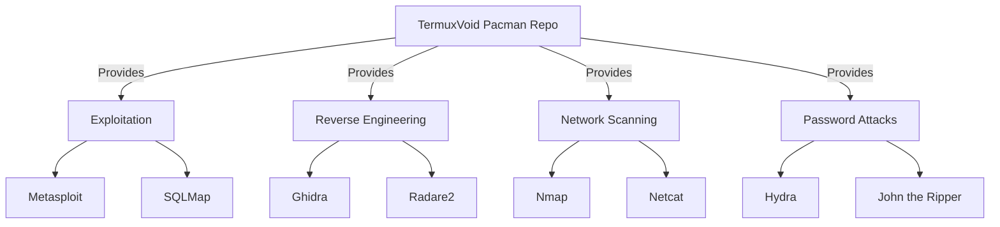

<div align="center">
  <a href="https://termuxvoid.github.io/">
    
    <h1>TermuxVoid Pacman Repository</h1>
  </a>
  <p><b>Unofficial Pacman APT-Style Repository: 233 Ethical Hacking & Pentesting Packages</b></p>

  <div>
    <a href="https://github.com/TermuxVoid/pacman-repo/stargazers">
      
    </a>
    <a href="https://github.com/TermuxVoid/pacman-repo/blob/main/LICENSE">
      
    </a>
    <a href="https://github.com/TermuxVoid/pacman-repo/issues">
      
    </a>
  </div>
</div>

## 📖 Table of Contents

- [Prerequisites](#-prerequisites)
- [Quick Installation](#-quick-installation)
- [Project Overview](#-project-overview)
- [Security & Transparency](#-security--transparency)
- [APT Users](#-apt-users)
- [Legal & Disclaimer](#-legal--disclaimer)
- [Frequently Asked Questions](#-frequently-asked-questions)
- [Support & Community](#-support--community)
- [Contribution & Support](#-contribution--support)

---

## 📋 Prerequisites

Before using the TermuxVoid pacman repository, ensure your environment meets these requirements:

- **Full pacman environment** — either a switched pacman bootstrap or `termux-penv` ([Switching package manager](https://wiki.termux.com/wiki/Switching_package_manager)). A plain `pkg install pacman` is not enough.
- **Android 7+** with ~2GB free storage for larger tools
- **Working internet connection** for package downloads
- **No root required** for most tools (some may need root for certain features)

---

## 🚀 Quick Installation

Run the following one-liner in your Termux terminal to add the repository automatically:

```bash
curl -sL https://github.com/termuxvoid/pacman-repo/raw/main/install-repo.sh | bash
```

> [!WARNING]
> Piping a remote script directly to `bash` executes it immediately. For maximum transparency, download and inspect `install-repo.sh` first, then run it locally.

Once the repository is added, install any tool using pacman:

```bash
pacman -Sy

# Install any tool
pacman -S <tool-name>

# Example
pacman -S metasploit-framework
```

> [!TIP]
> You can search tools with `pacman -Ss <tool-name>` and list everything from this repo with `pacman -Sl termuxvoid`.

## 🔍 Project Overview

**TermuxVoid** is an **unofficial custom repository** that bridges the gap between mobile convenience and professional security auditing. We host **233+ advanced security tools** that are not available in the official Termux repositories. Package installation happens on your device: depending on the tool, the package may build from source, install an upstream dependency, or download an upstream release.

Whether you are a professional penetration tester or an ethical hacking enthusiast, TermuxVoid turns your Android device into a portable powerhouse.

> [!NOTE]
> This repository contains tools that are often excluded from official sources due to complexity, licensing, or security sensitivity. Read a package's PKGBUILD and hook script before installing it.<br>

Each package lives in `packages/<name>/` as a standard pacman PKGBUILD:

- `PKGBUILD` — metadata (name, version, dependencies, description) plus packaging rules
- `<name>.install` — lifecycle hooks (`pre_install`, `post_install`, `pre_remove`, `post_remove`) that perform installation on your device
- `*-data.tar.gz` — files shipped inside the package where applicable

### What packages do—and do not—change

- No package modifies `$PATH`, `$HOME`, `$PREFIX`, or any other Termux environment variable.
- Most tool packages do not alter existing Termux configuration and expose commands through **symlinks** or package-manager-installed commands instead of environment mutation.
- Packages whose stated purpose is shell styling, themes, desktop environments, or similar customization may create or change relevant configuration files. Read their hooks carefully before installation and removal.
- Removal hooks are intended to remove files created by the package. Preserve your own configuration backups.

### Before you install

1. Read `packages/<name>/PKGBUILD` and `packages/<name>/<name>.install`.
2. Check every download URL, Git repository, package-manager command, and configuration change.
3. Review the upstream tool and its license, then install in a test environment first if unfamiliar.
4. Keep backups of personal configuration before installing shell, theme, or desktop packages.

Don't trust — verify. See [CONTRIBUTING.md](CONTRIBUTING.md) for the package layout and [SECURITY.md](SECURITY.md) for the security policy.

## 🛡️ Security & Transparency

TermuxVoid is an unofficial, community-maintained repository. Package definitions are published here so you can inspect what runs on installation and removal. The database (`termuxvoid.db`) and every package are **GPG signed**; import our key via `install-repo.sh` or manually with `pacman-key`.

Package-source expectations: contributors should provide the upstream project URL, use a pinned release, tag, or commit where practical, and verify an upstream checksum or signature when one is available. Review every network download, upstream package-manager command, file/configuration change, exposed command, and uninstall action before installing.

<details>
<summary><b>📊 View Mermaid Architecture</b></summary>


</details>

<div align="center">

<a href="assets/PACKAGES.md">
  
</a>

</div>

## 🐧 APT Users

The very same tools are also shipped as classic **APT packages** for standard (dpkg-based) Termux. If you are not on a pacman setup, use the APT repository instead:

**APT repository:** [github.com/termuxvoid/repo](https://github.com/termuxvoid/repo)

## Legal & Disclaimer

These tools are provided for **educational and authorized security research only**. You are responsible for ensuring your use complies with all applicable laws and regulations. Unauthorized access to systems you do not own or lack explicit permission to test is illegal. The maintainers assume no responsibility for any misuse.

## ❓ Frequently Asked Questions

<details>
<summary><b>Are these tools safe to use on a personal device?</b></summary>
<br>
Yes — nothing is pre-compiled here. Each tool is downloaded or built on your device during installation, so it runs in your own Termux environment. However, these are powerful security tools; ensure you understand what a tool does before executing it.
</details>

<details>
<summary><b>Do I need to switch my bootstrap to pacman?</b></summary>
<br>
For full functionality yes — this repository serves pacman-format packages. If you prefer to stay on apt/dpkg, use our <a href="https://github.com/termuxvoid/repo">APT repository</a> instead: same tools, same behaviour, different package manager.
</details>

<details>
<summary><b>Why is there a "-0" at the end of versions?</b></summary>
<br>
That is pacman's mandatory package release field (<code>pkgrel</code>). We keep it at 0 so the visible version matches upstream exactly (e.g. sqlmap 1.10.8-0). When we repackage without an upstream version change, the number increases.
</details>

<details>
<summary><b>How often are tools updated?</b></summary>
<br>
- Security patches within 24 hours<br>
- Version updates every Sunday<br>
- Emergency fixes as needed
</details>

<details>
<summary><b>How do I request a new package?</b></summary>
<br>
Open a GitHub Issue, contact us on Telegram @nullxvoid, or email termuxvoid@gmail.com.
</details>

<details>
<summary><b>How do I report a broken package?</b></summary>
<br>
Open an issue on GitHub with the tool name and error output. We aim to fix reported issues within 24 hours.
</details>

<details>
<summary><b>How do I uninstall the repository?</b></summary>
<br>
One command:

```bash
curl -sL https://github.com/termuxvoid/pacman-repo/raw/main/uninstall-repo.sh | bash
```

This removes the repository from `pacman.conf` and deletes our key from your pacman keyring. Packages you already installed remain until you remove them individually with `pacman -R <tool>`.
</details>

## 🌐 Support & Community

<div align="center">
  <a href="https://telegram.me/nullxvoid">
    
  </a>
  <a href="https://youtube.com/@alienkrishnorg">
    
  </a>
  <a href="https://github.com/TermuxVoid/pacman-repo">
    
  </a>
</div>

---

## 🛠️ Contribution & Support

Support the project to help us keep the packages updated and add more tools:

- ⭐ **Star** this repository to show your support.
- 🐛 **Report Bugs** responsibly via Issues.
- 📢 **Share** with the security community.

[View Complete Package List »](assets/PACKAGES.md)

<div align="center">
  <sub>Built with ❤️ for security researchers by <a href="https://github.com/Anon4You">Alienkrishn</a> | Built on-device for best compatibility</sub>
</div>
